# Telegram Account Registration Guide | Complete Step-by-Step Tutorial (2024)

## 🔥 **需要 Telegram 账号？加 QQ：2717344421 | 包登录 · 有质保** 🔥

<!-- SEO Meta Description -->
> **Complete guide on how to create a Telegram account** - Learn to register on Telegram via iPhone, Android, or desktop. Includes verification without personal phone number, multiple account setup, troubleshooting, and security tips.

## Table of Contents

- [What is Telegram Messenger](#what-is-telegram-messenger)
- [How to Create Telegram Account on iPhone](#how-to-create-telegram-account-on-iphone)
- [How to Create Telegram Account on Android](#how-to-create-telegram-account-on-android)
- [How to Create Telegram Account on Desktop](#how-to-create-telegram-account-on-desktop)
- [How to Register Telegram Without Phone Number](#how-to-register-telegram-without-phone-number)
- [How to Create New Telegram Account with Same Number](#how-to-create-new-telegram-account-with-same-number)
- [How to Log Out of Telegram](#how-to-log-out-of-telegram)
- [Telegram Security Settings](#telegram-security-settings)
- [Troubleshooting Guide](#troubleshooting-guide)
- [FAQ - Frequently Asked Questions](#faq---frequently-asked-questions)

---

## What is Telegram Messenger

**Telegram** is one of the most popular cloud-based instant messaging applications worldwide. Created by **Pavel Durov** and **Nikolai Durov** in 2013, Telegram has grown to become a go-to platform for millions of users seeking secure, fast, and feature-rich communication.

### Key Features of Telegram

| Feature | Description |
|---------|-------------|
| **End-to-End Encryption** | Secure secret chats with optional self-destruct timers |
| **Cloud Storage** | Access messages from any device simultaneously |
| **Group Chats** | Support up to 200,000 members |
| **Channels** | Broadcast messages to unlimited subscribers |
| **File Sharing** | Share files up to 2GB each |
| **Cross-Platform** | Available on iOS, Android, Windows, macOS, Linux, and web |

---

## How to Create Telegram Account on iPhone

Creating a Telegram account on your iPhone is quick and straightforward. Follow these steps:

### Step 1: Open the Telegram App

Locate the Telegram app icon on your iPhone home screen and tap to launch it.

*Finding and opening the Telegram app on iPhone*

### Step 2: Tap "Start Messaging"

Once the Telegram app opens, tap the **"Start Messaging"** button to proceed to the registration process.

*Starting the Telegram registration process*

### Step 3: Select Country and Enter Phone Number

Select your country from the dropdown menu, then enter your mobile phone number. Tap **"Continue"** to proceed.

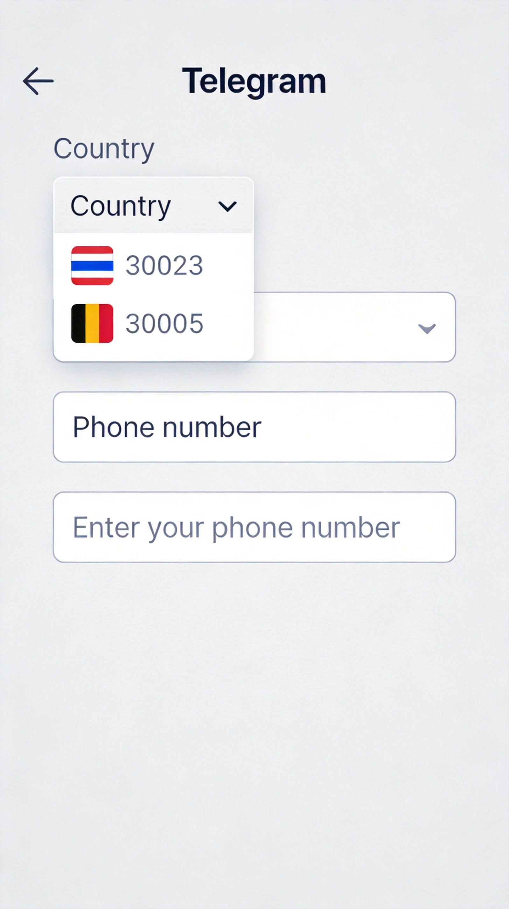

*Entering phone number for Telegram verification*

### Step 4: Enter Verification Code

A one-time password (OTP) will be sent to your registered phone number. Enter this code to verify your number.

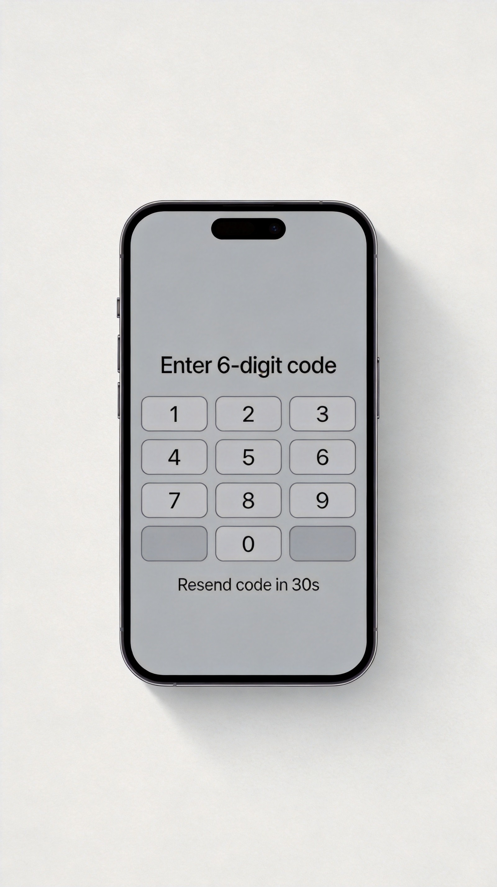

*Inputting the verification code*

### Step 5: Set Up Your Profile

Enter your **First Name** and **Last Name** (optional) to complete your Telegram profile setup.

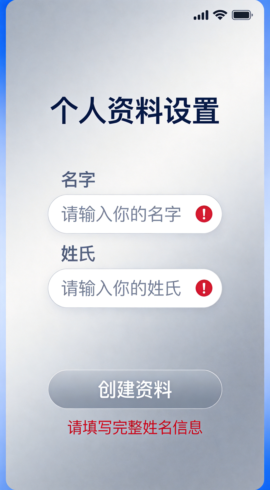

*Your Telegram account is now created*

**Congratulations!** Your Telegram account has been successfully created.

---

## How to Create Telegram Account on Android

The process to create a Telegram account on Android is nearly identical to iPhone. Here's how:

### Step 1: Install and Open Telegram

Find the Telegram icon on your phone and tap to open it.

*Locating Telegram on Android device*

### Step 2: Tap "Start Messaging"

Open the Telegram app and tap the **"Start Messaging"** button to begin registration.

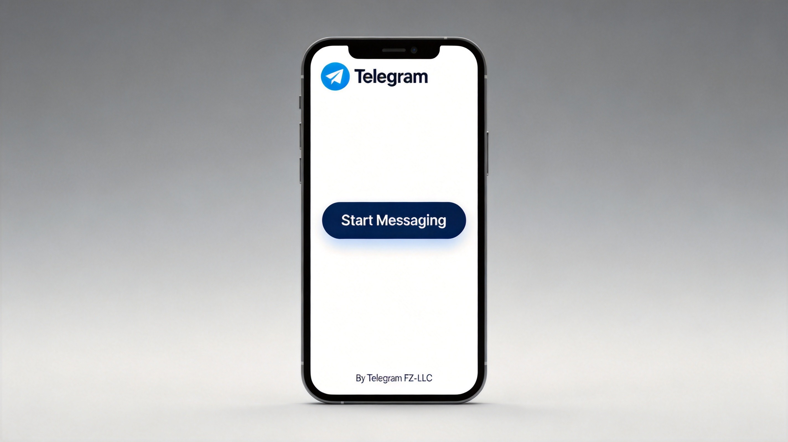

*Starting Telegram registration on Android*

### Step 3: Enter Your Phone Number

Select your country and provide your mobile phone number for verification.

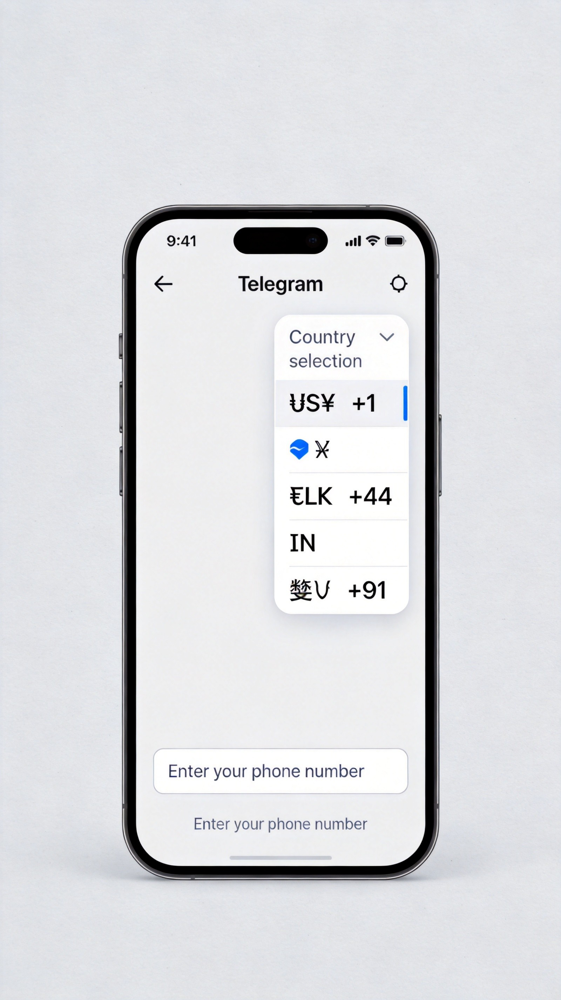

*Providing phone number for Telegram*

### Step 4: Wait for the Call

After entering your number, wait for an automated call to confirm your number.

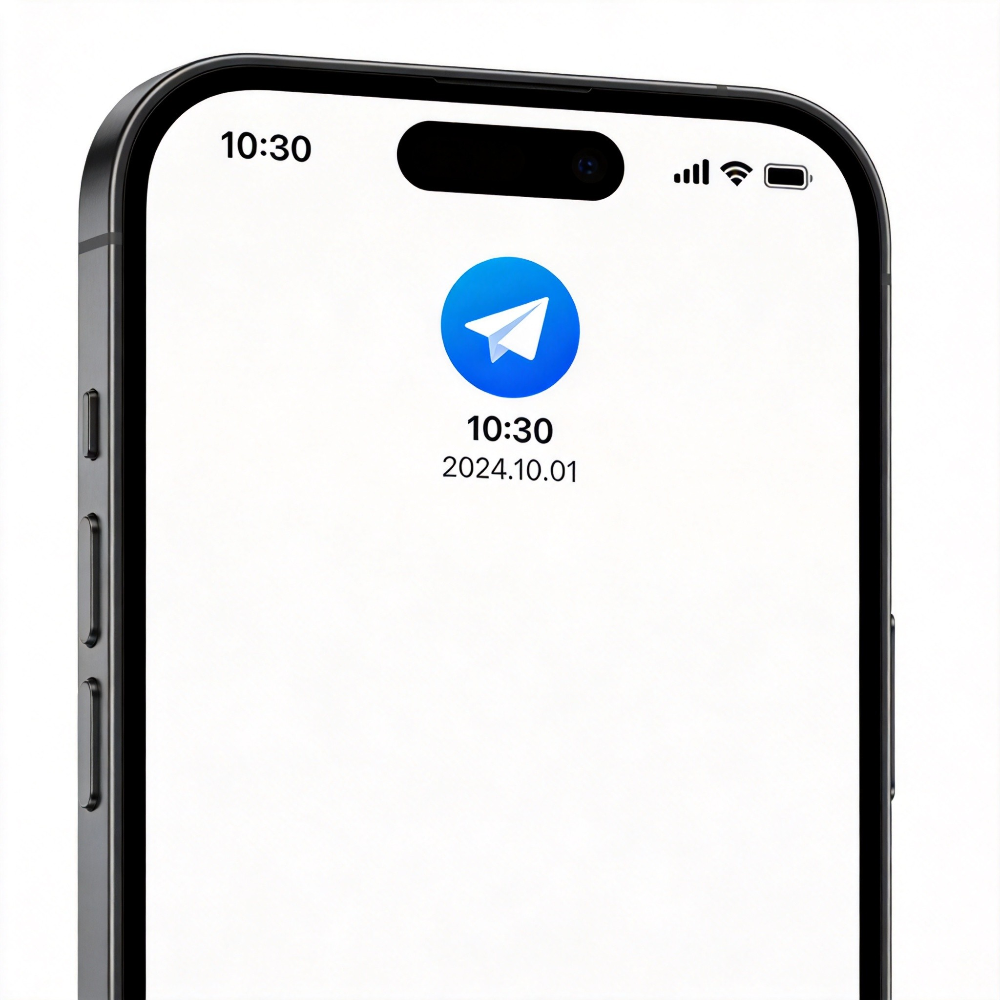

*Waiting for Telegram verification call*

### Step 5: Enter Your Name

Enter your first name and last name in the profile fields, then tap the arrow to continue.

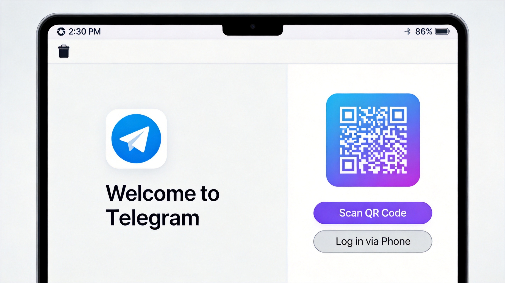

*Setting up your Telegram profile name*

### Step 6: Account Created

Your Telegram account is now ready! You can now make voice/video calls, send messages, join groups, and explore channels.

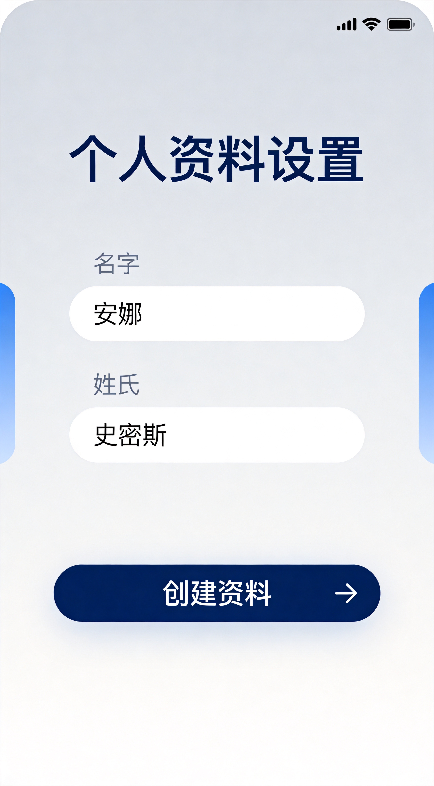

*Your Telegram account is now active*

**See also:**
- [How to Create a Telegram Channel](https://www.geeksforgeeks.org/how-to-create-a-telegram-channel/)
- [How to Add New Contact on Telegram](https://www.geeksforgeeks.org/add-a-new-contact-on-telegram/)

---

## How to Create Telegram Account on Desktop

You can also create a Telegram account using your computer. Here's how:

### Step 1: Open Telegram Desktop App

Click the Telegram desktop application icon to launch it.

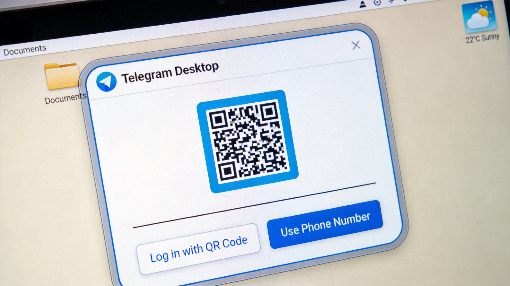

*Opening Telegram desktop application*

### Step 2: Tap "Start Messaging"

Click the **"Start Messaging"** button to proceed.

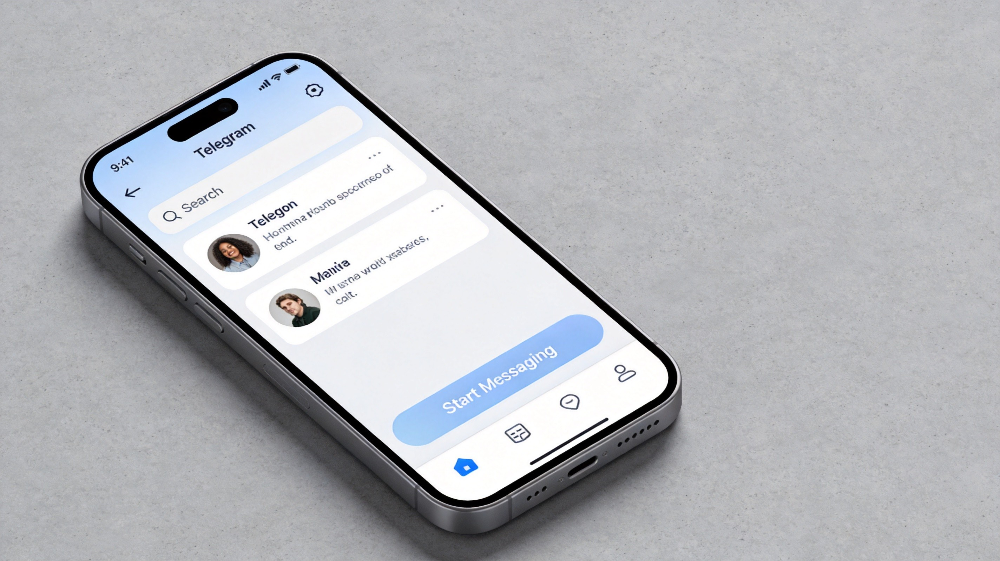

*Starting Telegram registration on desktop*

### Step 3: Login Options - QR Code or Phone Number

You have two login options:
1. **Scan QR Code** - Use your phone to scan the displayed QR code
2. **Phone Number** - Click **"Login with Phone Number"** to enter your number

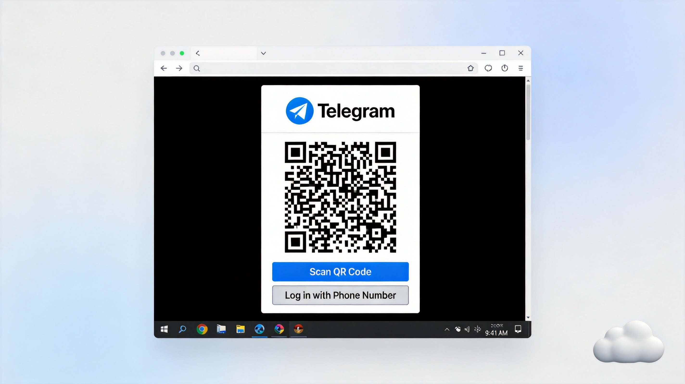

*Login with phone number option*

### Step 4: Enter Your Phone Number

Select your country, enter your phone number, and click **"Next"**. You'll receive an OTP code.

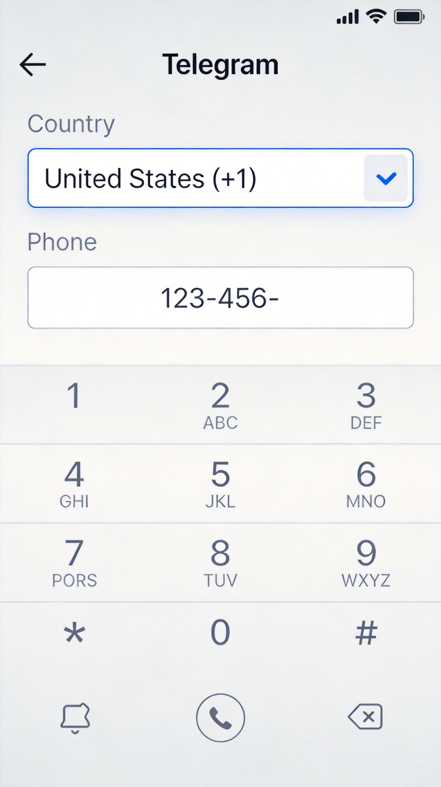

*Providing phone number for desktop login*

### Step 5: Enter Verification Code

Enter the verification code sent to your phone number via SMS.

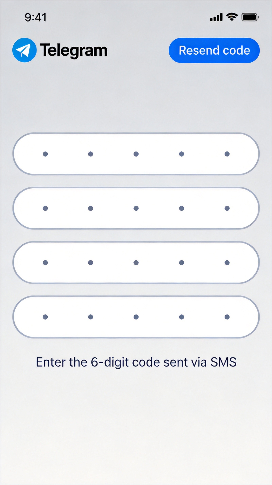

*Verifying phone number on desktop*

**Your Telegram account is now active on desktop!**

---

## How to Register Telegram Without Phone Number

Want to use Telegram without exposing your personal phone number? Here are **5 verified methods**:

### Method 1: Use a Virtual Phone Number (VoIP)

Virtual numbers from services like **Google Voice**, **TextNow**, or **TextFree** can receive SMS verification codes.

| Step | Action |
|------|--------|
| 1 | Register with a VoIP service provider |
| 2 | Get your free virtual number |
| 3 | Download and open Telegram app |
| 4 | Enter the VoIP number during registration |
| 5 | Enter the verification code received |

> **Note:** Some virtual numbers may not work with Telegram due to restrictions. Try another service if needed.

### Method 2: Use a Burner Phone

A **burner phone** is a temporary prepaid phone that provides a real number without linking to your personal information.

| Step | Action |
|------|--------|
| 1 | Purchase a cheap prepaid phone or SIM card |
| 2 | Insert the SIM card and ensure it can receive SMS |
| 3 | Download and open Telegram app |
| 4 | Use the temporary number for registration |
| 5 | Enter the verification code |

### Method 3: Use a Landline Phone

If you have a **landline**, you can receive the verification code via voice call instead of SMS.

| Step | Action |
|------|--------|
| 1 | Open Telegram app and start registration |
| 2 | Enter your landline number |
| 3 | When SMS verification fails, select **"Call Me"** option |
| 4 | Receive the code via automated voice call |
| 5 | Enter the code to complete setup |

### Method 4: Get a Dedicated SIM Card for Online Use

Purchase a **low-cost prepaid SIM card** specifically for online registrations.

| Step | Action |
|------|--------|
| 1 | Get a prepaid SIM that doesn't require personal info |
| 2 | Activate the SIM card |
| 3 | Use the number for Telegram verification |

### Method 5: Use Google Voice (US Only)

US users can get a free number from **Google Voice** that can receive SMS and calls.

| Step | Action |
|------|--------|
| 1 | Create a Google Voice account |
| 2 | Choose a free Google Voice number |
| 3 | Use this number for Telegram registration |
| 4 | Enter the verification code received |

---

## How to Create New Telegram Account with Same Number

**Important:** Telegram only allows **one account per phone number**. However, here are workarounds:

### Method 1: Delete Existing Account and Create New

1. Go to [Telegram Deactivation Page](https://my.telegram.org/auth?to=delete)
2. Enter your phone number in international format (+1234567890)
3. Receive and enter the confirmation code
4. Confirm account deletion
5. Wait 7 days, then register with the same number again

> ⚠️ **Warning:** Deleting your account will permanently erase all messages, contacts, and groups.

### Method 2: Use Telegram's Multi-Account Feature

Telegram allows **multiple accounts** on the same device:

1. Open Telegram app
2. Tap the menu (three horizontal lines)
3. Tap your phone number at the top
4. Select **"Add Account"**
5. Enter a different phone number for the new account
6. Switch between accounts anytime via the menu

---

## How to Log Out of Telegram

### On Mobile (iPhone/Android)

| Step | Action |
|------|--------|
| 1 | Open Telegram app |
| 2 | Tap the menu icon (three lines) |
| 3 | Tap **"Settings"** |
| 4 | Tap the three dots icon |
| 5 | Select **"Log Out"** |
| 6 | Confirm by tapping **"Log Out"** |

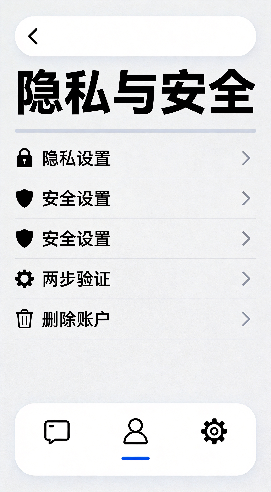

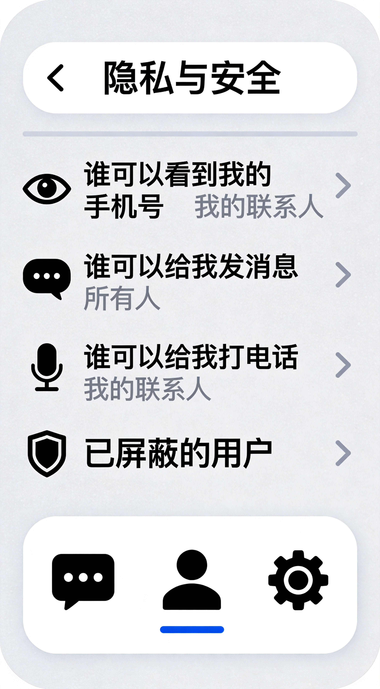

---

## Telegram Security Settings

After creating your account, enhance your security with these settings:

### Enable Two-Factor Authentication

1. Go to **Settings** → **Privacy and Security**
2. Tap **Two-Step Verification**
3. Create a strong password
4. Set a recovery email

### Adjust Privacy Settings

- **Last Seen & Online**: Set who can see your status
- **Profile Photo**: Control who can view your photo
- **Forwarded Messages**: Hide your identity when forwarding
- **Groups**: Limit who can add you to groups

### Enable Passcode Lock

1. **Settings** → **Privacy and Security** → **Passcode Lock**
2. Set a 4-digit PIN or use biometric unlock
3. Enable **Auto-lock** feature

---

## Troubleshooting Guide

### Common Issues and Solutions

| Problem | Solution |
|---------|----------|
| **Didn't receive SMS code** | Wait 5 minutes, try "Call Me" option, or use a different number |
| **Phone number already registered** | Reset password or use a different number |
| **Can't receive calls on landline** | Ensure your landline can receive international calls |
| **Virtual number not accepted** | Try a different VoIP service or prepaid SIM |
| **Account banned** | Contact Telegram support with your number |
| **Verification code expired** | Request a new code within the valid time window |

### Verification Issues

- **SMS not arriving**: Check your network connection, disable Do Not Disturb mode, or add Telegram to your SMS filter whitelist
- **Wrong country code**: Ensure you're using the correct international prefix (+1 for US, +44 for UK, etc.)
- **Phone number format**: Enter number without leading zeros or spaces

---

## FAQ - Frequently Asked Questions

### General Questions

#### How do I create a Telegram account?
To create a Telegram account, download the app, enter your phone number, and verify using the SMS code. You can also register via desktop app or web version.

#### Can I create 2 Telegram accounts?
Yes! You can have multiple Telegram accounts on the same device using different phone numbers. Use Telegram's built-in multi-account feature to switch between them.

#### Can I use Telegram without a phone number?
While Telegram requires phone verification, you can use virtual numbers, burner phones, or landlines to register without exposing your personal number.

#### Can I create a Telegram account with email?
No, Telegram doesn't support email-only registration. A phone number is required for verification, but you can use alternative numbers as described above.

#### Can I use the same number for 2 Telegram accounts?
No, each phone number can only be associated with one Telegram account. You'll need a different number for each account.

### Security Questions

#### Is Telegram safe to use?
Yes, Telegram offers end-to-end encryption for secret chats, two-factor authentication, and secure cloud storage. Regular chats use client-server encryption.

#### Are virtual numbers safe for Telegram verification?
Yes, reputable virtual number providers like Google Voice are generally safe. For maximum security, consider paid services with good reviews.

#### Is using a landline for Telegram verification safe?
Yes, as long as your landline can receive voice calls for verification purposes.

### Account Management

#### Can I change my Telegram phone number later?
Yes, Telegram allows you to change your number in Settings without losing your chats or contacts.

#### Are disposable phone numbers reliable?
Disposable numbers are convenient and quick, but they may not provide long-term reliability or security since they're often publicly available.

### Device-Specific Questions

#### How to create Telegram account on iPhone?
Download Telegram from App Store, tap "Start Messaging", enter your number, verify via SMS, and set up your profile.

#### How to create Telegram account on Android?
Download Telegram from Google Play, follow the same registration process as iPhone, and verify your phone number.

#### How to create Telegram account on PC/Mac?
Download Telegram Desktop or use the web version at web.telegram.org, then register using your phone number.

#### How to create Telegram account with US number?
Simply enter your US phone number (+1 area code) during registration. Telegram works with any international number.

---

## Additional Resources

- [How to Create a Telegram Channel](https://www.geeksforgeeks.org/how-to-create-a-telegram-channel/)
- [How to Create a Group in Telegram](https://www.geeksforgeeks.org/how-to-create-a-group-in-telegram/)
- [How to Generate Telegram QR Code](https://www.geeksforgeeks.org/how-to-generate-telegram-qr-code/)
- [How to Make a Call on Telegram](https://www.geeksforgeeks.org/how-to-make-a-call-on-telegram/)

---

## Conclusion

Creating a Telegram account is quick, free, and straightforward. Whether you're using a smartphone, tablet, or desktop computer, you can have your account set up in just a few minutes. Remember these key points:

✅ Download Telegram from official app stores
✅ Enter a valid phone number for verification
✅ Choose your preferred login method (SMS or call)
✅ Enable two-factor authentication for enhanced security
✅ Explore alternative verification methods if privacy is a concern

**Start your Telegram journey today and enjoy secure, fast, and feature-rich messaging!**

---

## License

This project is open source and available under the [MIT License](LICENSE).

---

## Contributing

Contributions are welcome! Please feel free to submit a Pull Request.

---

*Last updated: 2024*
